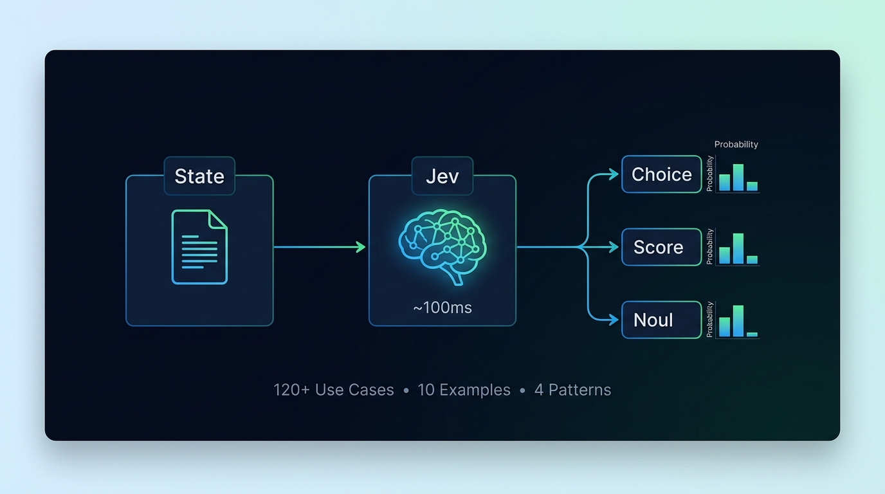
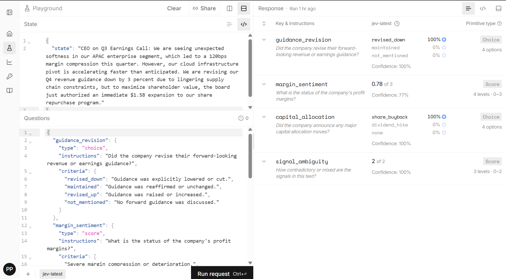

<h1 align="center">
  Jev Cookbook 🧠⚡️
</h1>

<p align="center">
  
  
  
  
  
</p>

<p align="center">
  
</p>

<p align="center">
  <strong>Production-ready examples, patterns, and theory for building with Jev — the 100ms System One AI.</strong>
  <br><br>
  <a href="#-quick-start-no-sdk-required">Quick Start</a> · <a href="#-examples">10 Examples</a> · <a href="THEORY.md">Theory</a> · <a href="USE_CASES.md">120+ Use Cases</a> · <a href="#-architectural-patterns">Patterns</a>
</p>

---

## ⚡️ What is Jev?

Jev is a "System One" AI model built by [TypeSafe AI](https://typesafe.ai) — a calibrated zero-shot semantic classifier, not a text generator. It takes a context `state` and typed `questions`, returning calibrated probability distributions instead of tokens. Because it doesn't generate text, Jev processes complex classification tasks in **~100ms**, operates at **400x lower cost** than traditional LLMs, and provides mathematically rigorous **calibrated confidence scores** for every decision.

## 🏗 Architecture: Where Jev Fits

Stop waiting seconds for an LLM to output a JSON boolean. Jev acts as the ultra-fast instinct layer in your application:

```text
[ Incoming Data ] 
       │
       ▼
 ┌─────────────┐
 │  Jev (100ms)│ ──(Low Confidence)──► 🤖 Slow LLM Fallback (GPT-4 / Claude)
 └──────┬──────┘
        │ (High Confidence)
        ▼
[ Structured JSON Decision ]
        │
        ▼
  ⚙️ Application Logic (Code acts on it)
```

## 🚀 Quick Start (No SDK Required)

### 1. The 30-Second Console Test

Go to [console.typesafe.ai](https://console.typesafe.ai). The console has **two input panes on the left** and a **response pane on the right**:

**State pane** — paste the context to evaluate:
```json
{
  "state": "The user clicked 'Cancel Subscription' after experiencing multiple app crashes."
}
```

**Questions pane** — paste your questions (top-level keys, NOT wrapped in `"questions"`):
```json
{
  "intent": {
    "type": "choice",
    "instructions": "Why is the user canceling?",
    "criteria": {
      "bug_frustration": "User encountered technical issues that broke their workflow.",
      "price": "The subscription is too expensive for the perceived value.",
      "competitor": "The user is switching to a competing product.",
      "unknown": "Reason is not clear from the available context."
    }
  },
  "is_churning": {
    "type": "noul",
    "instructions": "Is this user at serious risk of permanently leaving?"
  }
}
```

Hit **Run request** → see results in the Response pane in ~100ms.

Here's what the console actually looks like with our live trading test:

<p align="center">
  
</p>

### 2. Python `requests` (API)

For the API, `state` and `questions` are combined into a single request body:

```python
import os, requests
from dotenv import load_dotenv

load_dotenv()

resp = requests.post(
    "https://api.typesafe.ai/v1/systemone",
    headers={
        "Authorization": f"Bearer {os.getenv('TYPESAFE_API_KEY')}",
        "Content-Type": "application/json"
    },
    json={
        "model": "jev-1.13.0",
        "state": "The user clicked 'Cancel Subscription' after multiple app crashes.",
        "questions": {
            "intent": {
                "type": "choice",
                "instructions": "Why is the user canceling?",
                "criteria": {
                    "bug_frustration": "User encountered technical issues.",
                    "price": "Too expensive for perceived value.",
                    "unknown": "Reason not clear."
                }
            },
            "is_churning": {
                "type": "noul",
                "instructions": "Is this user at serious risk of permanently leaving?"
            }
        }
    }
).json()

intent = resp["answers"]["intent"]
print(f"Intent: {intent['choice']} (confidence: {intent['confidence']:.0%})")
```

> 💡 **No API key yet?** Use [OpenRouter](https://openrouter.ai) (no waitlist) with model `typesafe/jev-latest` and base URL `https://openrouter.ai/api/v1`.

## 🧱 The 3 Core Primitives

Jev has exactly three question types. **Always use `criteria`, never `options` or `min`/`max`.**

| Primitive | What it does | Schema | Example Output |
|-----------|-------------|--------|----------------|
| **Choice** | Pick one from a criteria dict | `{"type": "choice", "criteria": {"key": "description"}}` | `{"choice": "key", "confidence": 0.98, "probabilities": {...}}` |
| **Score** | Place on an ordered rubric (2-10 levels) | `{"type": "score", "criteria": ["level 0", "level 1", ...]}` | `{"score": 0.78, "confidence": 0.77, "probabilities": {...}}` |
| **Noul** | Boolean probability (0.0 → 1.0) | `{"type": "noul", "instructions": "Is X true?"}` | `{"noul": 0.95, "confidence": 0.95}` |

> ⚠️ **`score` returns a float**, not an integer — it's the probability-weighted expected value across levels.  
> Example: 23% level 0, 77% level 1, 0% level 2 → score = `0×0.23 + 1×0.77 + 2×0.00` = **0.77**

## 📊 Live Results: Trading Signal Extraction

We ran a deliberately ambiguous earnings call transcript through Jev (guidance down 3%, but $1.5B buyback). These are **real results** from the TypeSafe console:

| Question | Type | Result | Confidence |
|----------|------|--------|------------|
| `guidance_revision` | Choice | `revised_down` | 100% |
| `margin_sentiment` | Score | `0.78` of 3 | 77% |
| `capital_allocation` | Choice | `share_buyback` | 100% |
| `signal_ambiguity` | Score | `2` of 2 | 100% |

⏱ **Total evaluation time: 100.79ms** — 4 complex financial questions in parallel.

→ [See the full example with code](./examples/02-trading-signal-extraction/)

## 📂 Examples

Jump straight into runnable code. Every example has a `README.md`, a Python script, and a `payload.json` you can paste into the console.

| # | Example | Description | Pattern |
|---|---------|-------------|---------|
| 01 | [🎧 Customer Support Triage](./examples/01-customer-support-triage/) | Classify tickets by urgency, sentiment, churn risk in one call | Composite Scoring |
| 02 | [📈 Trading Signal Extraction](./examples/02-trading-signal-extraction/) | **LIVE TESTED** — Extract signals from earnings calls in 100ms | Composite Scoring |
| 03 | [🛡️ Agent Safety Guardrails](./examples/03-agent-safety-guardrails/) | `@jev_guardrail` decorator blocks dangerous tool calls | Confidence Gating |
| 04 | [🌐 Web Agent DOM Navigation](./examples/04-web-agent-dom-navigation/) | Speculative fan-out from `browser-use/jev-ultrafast` | Speculative Fan-Out |
| 05 | [🔀 LLM Model Router](./examples/05-llm-model-router/) | Route queries to cheap vs expensive models (83% cost savings) | Confidence Gating |
| 06 | [🚫 Content Moderation](./examples/06-content-moderation/) | Multi-dimensional toxicity + PII scoring at scale | Composite Scoring |
| 07 | [🏥 Healthcare Triage](./examples/07-healthcare-triage/) | Patient intake urgency classification (Jev flags, humans diagnose) | Confidence Gating |
| 08 | [📟 DevOps Incident Routing](./examples/08-devops-incident-routing/) | Auto-route alerts to the right on-call team | Composite Scoring |
| 09 | [📜 Legal Contract Analysis](./examples/09-legal-contract-analysis/) | Flag risky clauses for lawyer review | Confidence Gating |
| 10 | [🕵️ E-commerce Fraud Detection](./examples/10-ecommerce-fraud-detection/) | Real-time checkout fraud scoring in <100ms | Composite Scoring |

## 🧩 Architectural Patterns

Reusable patterns for composing Jev into production systems:

| Pattern | What it solves | Doc |
|---------|---------------|-----|
| **Composite Scoring** | Break complex judgments into atomic questions, combine in code | [→ Read](./patterns/composite-scoring.md) |
| **Confidence-Gated Routing** | Automate high-confidence, escalate low-confidence to humans/LLMs | [→ Read](./patterns/confidence-gated-routing.md) |
| **Speculative Fan-Out** | Evaluate all possible next actions in one parallel request | [→ Read](./patterns/speculative-fanout.md) |
| **Hybrid Agent Loop** | Jev for structure (100ms) + LLM for text (2s) = best of both | [→ Read](./patterns/hybrid-agent-loop.md) |

## 📚 Deep Dives

| Document | What's inside |
|----------|---------------|
| [**THEORY.md**](./THEORY.md) | First-principles derivation: what Jev is, 10 anti-patterns, 8 composition patterns, RLCD calibration explained |
| [**USE_CASES.md**](./USE_CASES.md) | 120+ concrete use cases across 10 domains, each with criteria ready to copy-paste |
| [**API Schema Reference**](./reference/api-schema.md) | Validated schemas for all primitives, every console error and its fix |
| [**Primitives Cheatsheet**](./reference/primitives-cheatsheet.md) | Quick copy-paste card with threshold recommendations |

## ⚖️ Jev vs LLMs

| Metric | Jev (System 1) | GPT-4o (System 2) |
|--------|----------------|-------------------|
| **Latency** | ~100ms | 2–5s |
| **Cost per decision** | ~$0.00001 | ~$0.01–$0.03 |
| **Output format** | Typed probabilities (guaranteed) | Prose you parse and hope |
| **Hallucination risk** | Zero (constrained to your schema) | Always possible |
| **Confidence scores** | Calibrated (85% = right ~85% of the time) | Generated text (meaningless statistically) |
| **Text generation** | ❌ Cannot generate text | ✅ Full generation |
| **Multi-step reasoning** | ❌ Single-pass classification | ✅ Chain-of-thought |

## ⚠️ Common Mistakes

| Mistake | Error You'll See | Fix |
|---------|-----------------|-----|
| Using `options: [...]` for Choice | `unexpected property "options"` | Use `criteria: { "key": "description" }` |
| Using `min` / `max` for Score | `unexpected property "min"` | Use `criteria: ["level 0", "level 1", ...]` |
| Wrapping questions in `{"questions": {...}}` | `needs a "type" — noul, choice, or score` | Put question keys at top level in console |
| Missing `criteria` on Choice/Score | `requires criteria` | Always include `criteria` |
| Expecting text output | — | Jev returns probabilities, not prose |

## 🌍 Community & Resources

| Resource | Link |
|----------|------|
| TypeSafe Console (Playground) | [console.typesafe.ai](https://console.typesafe.ai) |
| TypeSafe Docs | [docs.typesafe.ai](https://docs.typesafe.ai) |
| jev-ultrafast (web agent) | [github.com/browser-use/jev-ultrafast](https://github.com/browser-use/jev-ultrafast) |
| OpenRouter (no waitlist) | [openrouter.ai](https://openrouter.ai) |

---

<p align="center">
  Explored and documented by <a href="https://github.com/paramjeetn">@paramjeetn</a> — September 2026<br>
  <b>If this helped you build faster, please ⭐️ Star and 🍴 Fork this repository!</b>
</p>
